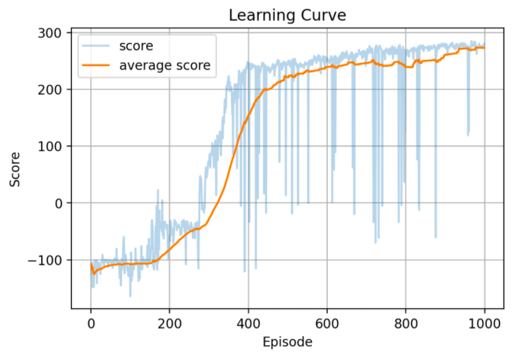
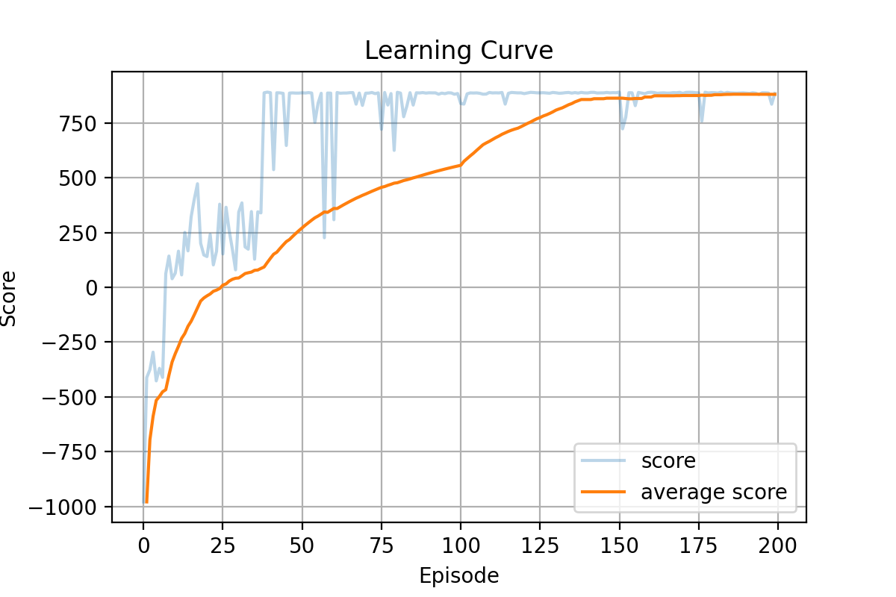
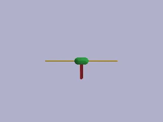
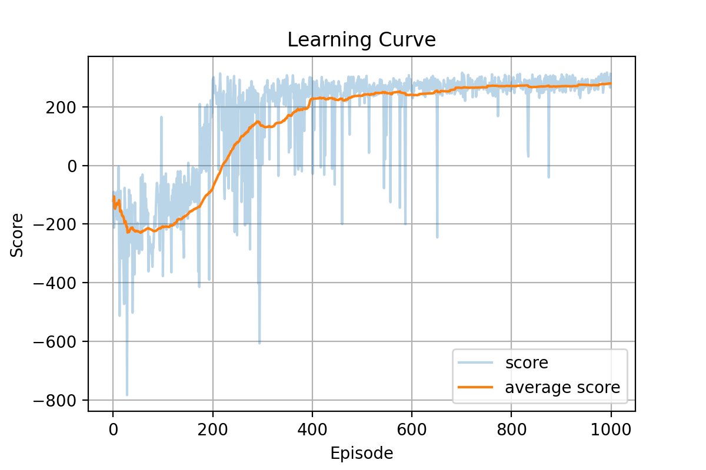
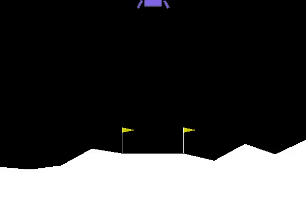

# Twin Delayed Deep Deterministic Policy Gradient (TD3) with PyTorch

This repo contains a PyTorch implementation of the Deep Reinforcement Learning algorithm Twin Delayed Deep Deterministic Policy Gradient (TD3), as described in the paper [Addressing Function Approximation Error in Actor-Critic Methods](https://arxiv.org/pdf/1802.09477.pdf) (2018)

You can see below a few learning curves along with gifs of TD3 agents (trained with this code) play the Bipedal Walker, Inverted Pendulum Swingup and Lunar Lander environments of Gym and PyBullet.

 


 

 


## Requirements
|Library         | Version |
|----------------|---------|
|`Python`        |  `3.8`  |
|`torch`         |  `1.8.1`|
|`gym`           | `0.18.3`|
|`numpy`         | `1.19.5`|
|`pybullet`      | `3.21`  |


## Folders and Files Description

### Folders

|Folder name       |                     Description                                    |
|------------------|--------------------------------------------------------------------|
|`src`             | All `.py` sourch files                                             |
|`tmp `            | A temporary file for results savings                               |
|`assets`          | Non-code related files like videos, pictures, etc                 |


### Files

|File name            |                     Description                                    |
|---------------------|--------------------------------------------------------------------|
|`main.py`            | General main application for training/playing a TD3 based agent    |
|`agents.py`          | Containing the TD3 agent class                                     |
|`networks.py`        | Networks in used by agents (Actor and Critic networks)             |
|`utils.py`           | General utility functions                                          |
|`buffer.py`          | A replay buffer class, used for offline training                   |
|`TD3_notebook.ipynb` | A TD3 notebook to run on Colab with GPU                            |

### Notebook

| #   | file            | Subject                                         | Colab             | Nbviewer               |
|:----:|:--------------:|:------------------------------------------------:|:-----------------:|:---------------------:|
| 1   | `TD3_notebook.ipynb` | Notebook to run on Colab with a GPU   | [](https://colab.research.google.com/drive/1nf63qekQpuY6BiJBzMI9XwovpGbt_8LL#scrollTo=MkIwmYFSg8nB)        | [](https://nbviewer.org/github/RoyElkabetz/TD3_with_PyTorch/blob/main/src/TD3_notebook.ipynb)|


## Command Line API

You should run the `main.py` file with the following arguments:


|Argument             | Description                                                                                   |
|---------------------|-----------------------------------------------------------------------------------------------|
|`-play`              | Choosing the mode of the agent, False for learning or True for playing and render to screen   |
|`-gamma`             | Discount factor for the update rule, default=0.99                                             |
|`-alpha`             | The Actor network learning rate                                                               |
|`-beta`              | The Critic and Value networks learning rate                                                   |
|`-fc1_dim`           | The dimension of the first Linear layer across all networks                                   |
|`-fc2_dim`           | The dimension of the second Linear layer across all networks                                  |
|`-memory_size`       | The Replay Buffer memory size                                                                 |
|`-batch_size`        | The batch size                                                                                |
|`-tau`               | The parameters update constant -- 1 for hard update, 0 for no update                          |
|`-update_period`     | The period for updating the networks weights                                                  |
|`-noise_std`         | The standard deviation of the action additive gaussian noise                                  |
|`-warmup`            | Number of transitions passes before learning starts                                           |
|`-noise_clip`        | The value for gaussian noise clipping                                                         |
|`-n_games`           | Number of games / episodes                                                                    |
|`-env_name`          | The environment name, PyBullet or Gym (see notes below)                                       |
|`-load_checkpoint`   | Load a model checkpoint, default=False                                                        |
|`-gpu_to_cpu`        | Load to a CPU a model that was trained on a GPU, set to True, else False                      |
|`-dir`               | Path for loading and saving models and plots                                                  |
|`-monitor`           | If True, a video is being saved for each episode (only if the ffmpeg package is installed)    |


## Training and Playing
- Training a TD3 agent on the *InvertedDoublePendulumBulletEnv-v0* environment with defualt arguments as stated in the TD3 paper [1]

```text
python3 main.py
``` 
- Training a TD3 agent on the *InvertedPendulumBulletEnv-v0* for 400 games with memory buffer size of 10000, batch size of 32 and warmup of 300 learning steps

```text
python3 main.py -memory_size 10000 -batch_size 32 -warmup 300 -n_games 400 -env_name InvertedDoublePendulumBulletEnv-v0
``` 

- Training a TD3 agent from a checkpoint for 100 games

```text
python3 main.py -n_games 400 -load_checkpoint True
``` 

- Playing a single game of *InvertedPendulumBulletEnv-v0* (and render it to the screen) with an untrained agent 

```text
python3 main.py -n_games 1 -play True -env_name InvertedPendulumBulletEnv-v0
```

- Playing 5 games of *InvertedDoublePendulumBulletEnv-v0* with a trained agent and save the videos

```text
python3 main.py -n_games 5 -monitor True -play True -load_checkpoint True -env_name InvertedDoublePendulumBulletEnv-v0
```

### Notes
1. In order to load a saved checkpoint, the networks should be in the `tmp\name_of_env` directory, with the next names: Actor, Critic_1, Critic_2, Target_Actor. Target_Critic_1 and Target_Critic_1.
2. For some reason the PyBullet environmets do not work when called with PyBullet, instead call with Bullet (i.e. use `InvertedDoublePendulumBulletEnv-v0` and not `InvertedDoublePendulumPyBulletEnv-v0`).
3. The current networks for the environments in the `tmp` folder belong to trained agents. You can play with them by running the next code in the command line 
```text
python3 main.py -n_games 5 -play True -load_checkpoint True -gpu_to_cpy True -env_name BipedalWalker-v3
```

```text
python3 main.py -n_games 5 -play True -load_checkpoint True -gpu_to_cpy True -env_name InvertedPendulumSwingupBulletEnv-v0
```


## Reference

[1]  [Addressing Function Approximation Error in Actor-Critic Methods](https://arxiv.org/pdf/1802.09477.pdf) (2018)

[2]  [Modern Reinforcement Learning: Actor Critic algorithms Course - Phil Tabor](https://www.udemy.com/course/actor-critic-methods-from-paper-to-code-with-pytorch/) (great comprehensive course about Actor Critic algorithms)


 

 
 
